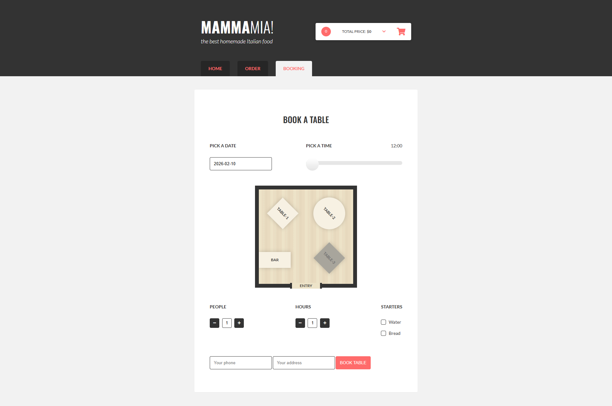

## English

### Pizzeria App

This is a simple pizzeria web application that allows users to place and customize orders, as well as book a table.
The main goal of this project was to practice building an interactive frontend application using JavaScript and responsive layouts.

### Main features
- Place a food order
- Customize orders (e.g. options and quantities)
- Book a table

### Built with
- HTML
- SCSS / CSS
- JavaScript

### Libraries used
- rangeSlider.js

### Requirements
- Node.js (tested on v24.12.0, Windows)
- Git (tested on v2.52.0, Windows)

### How to run the project
```bash
npm run init-project
npm run watch
```

### Media
**Home Page**


**Order Page**


**Booking Page**

